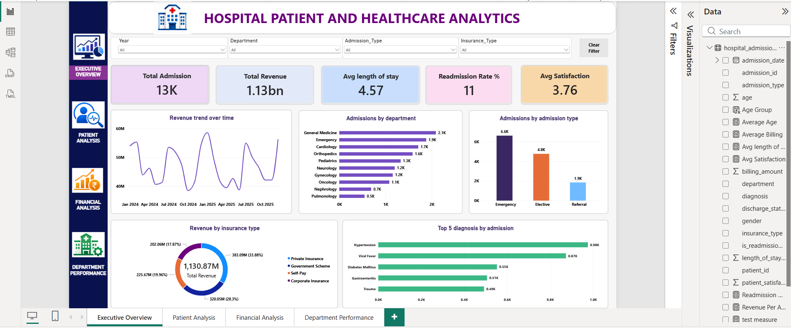
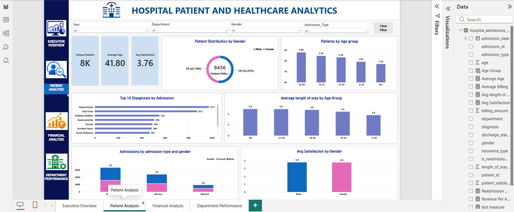
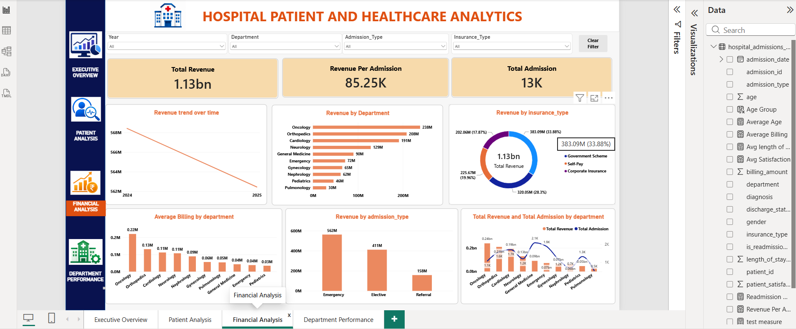
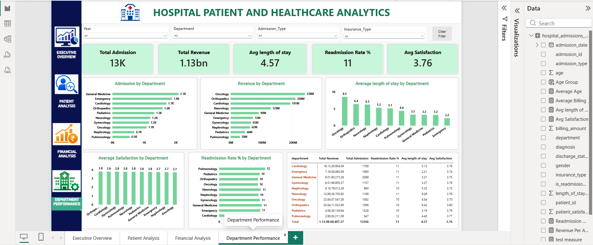

````markdown
# 🏥 Hospital Patient & Healthcare Analytics

> An end-to-end healthcare analytics project using **Python, SQL, MySQL, Machine Learning, and Power BI** to analyze hospital admissions, patient demographics, department performance, revenue, patient satisfaction, and 30-day readmission risk.


---

## 📌 Project Overview

This project presents an end-to-end healthcare analytics workflow built around a synthetic hospital admissions dataset containing **13,266 admission records** covering the period from **January 2024 to December 2025**.

The project combines:

- Python-based data analysis
- Data quality validation
- Exploratory Data Analysis (EDA)
- MySQL business analysis
- Hospital KPI analysis
- Revenue and department analysis
- Patient satisfaction analysis
- 30-day readmission analysis
- Machine Learning
- Power BI dashboarding

The objective is to transform raw hospital admission data into meaningful **operational, financial, and patient-level insights**.

> ⚠️ **Dataset Disclaimer:** The dataset is synthetic and is used only for educational, analytical, and portfolio purposes. It does not contain real patient information.

---

# 🎯 Business Objectives

The project addresses the following healthcare analytics questions:

- What is the overall hospital admission volume?
- How much revenue is generated across departments?
- Which departments have the highest admission volumes?
- Which departments contribute the most revenue?
- How does hospital activity change over time?
- What are the most common diagnoses?
- How are patients distributed across age groups and genders?
- How do admission types differ?
- How does insurance type affect hospital activity?
- What is the 30-day readmission rate?
- How does readmission vary by department?
- How does length of stay relate to patient satisfaction?
- Can patient and admission characteristics be used to estimate 30-day readmission risk?
- How can hospital KPIs be monitored through an interactive Power BI dashboard?

---

# 📊 Dataset Overview

The dataset contains **13,266 hospital admission records** and **14 fields**.

### Dataset Period

**January 2024 – December 2025**

### Key Metrics

| Metric | Value |
|---|---:|
| Admission Records | 13,266 |
| Unique Patients | 8,436 |
| Analysis Period | Jan 2024 – Dec 2025 |
| Number of Fields | 14 |
| Total Revenue | ₹113.1 Cr |
| Average Length of Stay | 4.57 days |
| 30-Day Readmission Rate | 10.60% |
| Average Patient Satisfaction | 3.76 / 5 |

---

# 🧾 Dataset Fields

| Column | Description |
|---|---|
| `admission_id` | Unique admission identifier |
| `patient_id` | Patient identifier |
| `admission_date` | Date of hospital admission |
| `department` | Hospital department |
| `diagnosis` | Primary diagnosis |
| `age` | Patient age |
| `gender` | Patient gender |
| `insurance_type` | Insurance/payment category |
| `admission_type` | Emergency, elective, or referral admission |
| `length_of_stay_days` | Number of days spent in hospital |
| `billing_amount` | Hospital billing amount |
| `discharge_status` | Patient discharge outcome |
| `is_readmission_30d` | Indicates readmission within 30 days |
| `patient_satisfaction` | Patient satisfaction score |

---

# 🛠️ Technology Stack

## Python

- Pandas
- NumPy
- Matplotlib
- Seaborn
- Scikit-learn
- Jupyter Notebook

## Database & SQL

- MySQL
- SQL Aggregations
- `GROUP BY`
- `ORDER BY`
- `CASE WHEN`
- Common Table Expressions (CTEs)
- Window Functions
- Ranking
- Business KPI queries

## Machine Learning

- Logistic Regression
- One-Hot Encoding
- StandardScaler
- Stratified Train/Test Split
- ROC-AUC
- Precision
- Recall
- F1-Score
- Classification Report

## Business Intelligence

- Microsoft Power BI
- KPI Cards
- Interactive Filters
- Trend Analysis
- Department Analysis
- Patient Analysis
- Financial Analysis

---

# 🔄 Project Workflow

```text
Raw Hospital Dataset
        │
        ▼
Data Loading
        │
        ▼
Data Quality Checks
        │
        ▼
Data Preparation
        │
        ▼
Exploratory Data Analysis
        │
        ▼
Hospital KPI Analysis
        │
        ├──────────────► MySQL Business Analysis
        │
        ▼
Feature Engineering
        │
        ▼
Machine Learning
        │
        ▼
30-Day Readmission Risk Analysis
        │
        ▼
Power BI Dashboard
        │
        ▼
Business Insights
````

---

# 1️⃣ Data Loading & Data Quality

Python and Pandas were used to load and inspect the hospital admission dataset.

### Quality checks included:

* Dataset dimensions
* Column names
* Data types
* Missing values
* Duplicate records
* Categorical variables
* Numerical variables
* Date ranges
* Descriptive statistics

### Validation Results

```text
Records: 13,266
Columns: 14
Duplicate rows: 0
```

The dataset was also checked for missing values before downstream analysis.

---

# 2️⃣ 🧹 Data Preparation

The data preparation stage focused on making the dataset suitable for analytics, SQL analysis, machine learning, and Power BI.

### Preparation steps

* Date parsing
* Data-type validation
* Duplicate validation
* Missing-value inspection
* Categorical-variable inspection
* Numerical-variable inspection
* Machine-learning feature preparation
* Target-variable preparation

---

# 3️⃣ 📈 Exploratory Data Analysis

EDA was performed using Python to understand hospital operations and patient characteristics.

### Areas analyzed

* Patient age distribution
* Gender distribution
* Department admissions
* Diagnosis frequency
* Admission types
* Insurance types
* Length of stay
* Billing amounts
* Patient satisfaction
* Discharge status
* Readmission patterns
* Monthly admission trends
* Monthly revenue trends

---

# 4️⃣ 🗄️ MySQL Business Analysis

MySQL was used to perform structured business analysis on the hospital admissions dataset.

### Key SQL analyses

* Total admissions
* Unique patients
* Total revenue
* Average billing amount
* Average length of stay
* Department performance
* Diagnosis volume
* Revenue by diagnosis
* Gender distribution
* Insurance analysis
* Admission-type analysis
* Discharge-status analysis
* 30-day readmission rate
* Department-wise readmission analysis
* Patient satisfaction by department
* Age-group analysis
* Monthly admissions
* Monthly revenue
* High-value admissions
* Readmitted patient analysis

### SQL Concepts Demonstrated

```text
SELECT
WHERE
GROUP BY
ORDER BY
COUNT()
SUM()
AVG()
MIN()
MAX()
CASE WHEN
Common Table Expressions (CTEs)
Window Functions
RANK() OVER()
SUM() OVER()
```

### SQL File

The complete SQL analysis is available here:

```text
sql/analysis_queries.sql
```

---

# 5️⃣ 🏥 Hospital KPI Analysis

The project analyzes several important hospital KPIs.

### Core KPIs

| KPI                    |    Result |
| ---------------------- | --------: |
| Total Admissions       |    13,266 |
| Unique Patients        |     8,436 |
| Total Revenue          | ₹113.1 Cr |
| Average Length of Stay | 4.57 days |
| Readmission Rate       |    10.60% |
| Patient Satisfaction   |  3.76 / 5 |

These KPIs provide a high-level view of hospital activity, financial performance, patient experience, and readmission patterns.

---

# 6️⃣ 💰 Financial Analysis

Financial analysis was performed to understand billing and revenue patterns.

### Areas analyzed

* Total hospital revenue
* Revenue by department
* Revenue by diagnosis
* Average billing amount
* Insurance-wise revenue
* Monthly revenue
* High-value admissions

The analysis helps identify differences in revenue contribution across departments, diagnoses, and payment categories.

---

# 7️⃣ 🏢 Department Analysis

Department-level analysis was performed using admissions, revenue, length of stay, satisfaction, and readmission metrics.

Example department metrics include:

* Admission volume
* Revenue contribution
* Average length of stay
* Patient satisfaction
* Readmission rate

This allows hospital operations to be examined at department level rather than only through overall hospital KPIs.

---

# 8️⃣ 👥 Patient & Demographic Analysis

Patient-level analysis includes:

* Age distribution
* Age groups
* Gender distribution
* Admission type
* Insurance type
* Diagnosis
* Length of stay
* Patient satisfaction
* Discharge status

These analyses help identify patterns within the synthetic patient population.

---

# 9️⃣ 🤖 Machine Learning — 30-Day Readmission Prediction

A **Logistic Regression** model was developed to estimate the probability of 30-day readmission using selected patient and admission characteristics.

## Target Variable

```text
is_readmission_30d
```

---

## Features Used

The model uses:

* Age
* Length of stay
* Billing amount
* Department
* Insurance type
* Admission type
* Gender

---

## Preprocessing

Categorical variables were transformed using:

```text
One-Hot Encoding
```

Numerical variables were standardized using:

```text
StandardScaler
```

Because the readmission class is relatively smaller than the non-readmission class, the model uses:

```text
class_weight = "balanced"
```

---

# 🔬 Model Evaluation

The dataset was divided using a stratified train/test split:

| Dataset  | Percentage |
| -------- | ---------: |
| Training |        75% |
| Testing  |        25% |

The model was evaluated using:

* ROC-AUC
* Precision
* Recall
* F1-Score
* Classification Report
* ROC Curve

### Model Result

```text
ROC-AUC: 0.812
```

The ROC-AUC value indicates the model's ranking ability on the held-out test data for this synthetic dataset.

---

# 📈 ROC Curve

The generated ROC curve is available in:

```text
outputs/readmission_model_roc.png
```

You can view the output directly from the repository:

**Readmission Model ROC Curve**

[https://github.com/venkatsubbarao123/Hospital-patient-and-healthcare-analytics/blob/main/outputs/readmission_model_roc.png](https://github.com/venkatsubbarao123/Hospital-patient-and-healthcare-analytics/blob/main/outputs/readmission_model_roc.png)

> ⚠️ **Important:** This model is an educational analytical exercise using synthetic data. It is not intended for clinical diagnosis, treatment decisions, patient care, or medical decision-making.

---

# 📊 Power BI Dashboard

An interactive Power BI dashboard was created to present the healthcare analytics results.

The dashboard contains four major analytical sections:

### 1. Executive Overview

Provides a high-level view of:

* Total admissions
* Total revenue
* Readmission rate
* Patient satisfaction
* Admission trends
* Hospital KPIs

### 2. Patient Analysis

Includes:

* Patient demographics
* Age groups
* Gender distribution
* Admission types
* Patient characteristics
* Readmission patterns

### 3. Financial Analysis

Includes:

* Total revenue
* Billing amounts
* Revenue trends
* Insurance categories
* Department revenue
* High-value admissions

### 4. Department Performance

Includes:

* Department admissions
* Department revenue
* Average length of stay
* Patient satisfaction
* Readmission rates
* Revenue contribution

---

# 📷 Dashboard Screenshots

Dashboard screenshots are available in:

```text
screenshots/
```

### Executive Overview



### Patient Analysis



### Financial Analysis



### Department Performance



---

# 💡 Key Analytical Findings

The analysis of the synthetic dataset produced the following observations.

### 📅 Admission Trends

Hospital admissions vary across months and periods, providing an opportunity to analyze operational demand and capacity planning.

### 🏢 Department Performance

Departments differ in admission volume, revenue contribution, average length of stay, patient satisfaction, and readmission patterns.

### 💰 Revenue

Revenue contribution varies substantially across departments and admission categories.

### 🔄 Readmissions

The overall 30-day readmission rate in the dataset is:

```text
10.60%
```

Department-level analysis can be used to investigate differences in readmission patterns.

### ⭐ Patient Satisfaction

The average patient satisfaction score is:

```text
3.76 / 5
```

The project also explores the relationship between satisfaction and hospital stay duration.

> These observations are based exclusively on the synthetic dataset used in this portfolio project and should not be interpreted as findings about real-world hospitals or patient populations.

---

# 📌 Business Analysis Opportunities

The dashboard and analysis can support questions such as:

* Where is admission volume concentrated?
* Which departments contribute the most revenue?
* Which departments require closer readmission monitoring?
* How does patient satisfaction vary across departments?
* What are the monthly admission patterns?
* How are insurance categories distributed?
* Which admissions have unusually high billing amounts?
* How does length of stay vary across departments?
* Which diagnoses account for a large share of admissions?

---

# 📁 Project Structure

```text
Hospital-patient-and-healthcare-analytics/
│
├── data/
│   └── hospital_admissions_data.csv
│
├── notebooks/
│   ├── Hospital_analytics.ipynb
│   └── mysql_connection_test.py
│
├── sql/
│   └── analysis_queries.sql
│
├── powerbi/
│   └── Hospital_Healthcare_Analytics.pbix
│
├── screenshots/
│   ├── executive_overview.png
│   ├── patient_analysis.png
│   ├── financial_analysis.png
│   └── department_performance.png
│
├── outputs/
│   └── readmission_model_roc.png
│
├── README.md
├── requirements.txt
├── LICENSE
└── .gitignore
```

---

# 🚀 How to Run the Project

## 1. Clone the Repository

```bash
git clone https://github.com/venkatsubbarao123/Hospital-patient-and-healthcare-analytics.git
```

Move into the project directory:

```bash
cd Hospital-patient-and-healthcare-analytics
```

---

## 2. Install Dependencies

Create a virtual environment if desired:

```bash
python -m venv .venv
```

Activate it on Windows:

```powershell
.venv\Scripts\Activate.ps1
```

Install the required packages:

```bash
pip install -r requirements.txt
```

---

# 📓 3. Run the Jupyter Notebook

Start Jupyter:

```bash
python -m notebook
```

Open:

```text
notebooks/Hospital_analytics.ipynb
```

Run the notebook cells in order.

The notebook performs:

```text
Data Loading
      ↓
Data Inspection
      ↓
Data Quality Checks
      ↓
Exploratory Analysis
      ↓
Feature Preparation
      ↓
Machine Learning
      ↓
Model Evaluation
```

---

# 🗄️ 4. MySQL Setup

The project uses **MySQL** for database analysis.

## Create the database

```sql
CREATE DATABASE healthcare_analytics;
```

Select the database:

```sql
USE healthcare_analytics;
```

---

## Create the admissions table

```sql
CREATE TABLE admissions (
    admission_id VARCHAR(50),
    patient_id VARCHAR(50),
    admission_date DATE,
    department VARCHAR(100),
    diagnosis VARCHAR(255),
    age INT,
    gender VARCHAR(20),
    insurance_type VARCHAR(50),
    admission_type VARCHAR(50),
    length_of_stay_days INT,
    billing_amount DECIMAL(12,2),
    discharge_status VARCHAR(50),
    is_readmission_30d BOOLEAN,
    patient_satisfaction DECIMAL(3,2)
);
```

---

## Load the Dataset

Import:

```text
data/hospital_admissions_data.csv
```

into the `admissions` table.

The dataset contains:

```text
13,266 rows
14 columns
```

---

## Run SQL Analysis

Open:

```text
sql/analysis_queries.sql
```

Execute the queries using MySQL Workbench or another MySQL client.

---

# 🔐 MySQL Connection

The project includes:

```text
notebooks/mysql_connection_test.py
```

The script verifies the connection and reads the admissions table.

For security, database passwords should **not** be stored directly in source code or committed to GitHub.

---

# 📊 5. Open the Power BI Dashboard

The Power BI report is located at:

```text
powerbi/Hospital_Healthcare_Analytics.pbix
```

Open the file using **Microsoft Power BI Desktop**.

The dashboard contains:

```text
Executive Overview
Patient Analysis
Financial Analysis
Department Performance
```

---

# 📈 6. Machine Learning Output

The generated ROC curve is stored at:

```text
outputs/readmission_model_roc.png
```

---

# 📌 Project Deliverables

| Deliverable           | Location       |
| --------------------- | -------------- |
| Raw Dataset           | `data/`        |
| Python Analysis       | `notebooks/`   |
| SQL Analysis          | `sql/`         |
| Power BI Dashboard    | `powerbi/`     |
| Dashboard Screenshots | `screenshots/` |
| ML Output             | `outputs/`     |
| Documentation         | `README.md`    |

---

# 🧠 Skills Demonstrated

This project demonstrates practical experience with:

### Data Analytics

* Data cleaning
* Data validation
* Exploratory Data Analysis
* KPI analysis
* Trend analysis
* Business insights

### Python

* Pandas
* NumPy
* Matplotlib
* Seaborn
* Scikit-learn
* Jupyter

### SQL

* Data aggregation
* Filtering
* Grouping
* Conditional logic
* CTEs
* Window functions
* Ranking
* Business analysis

### Machine Learning

* Feature preprocessing
* Classification
* Logistic Regression
* Imbalanced-class handling
* Model evaluation
* ROC-AUC

### Power BI

* Dashboard design
* KPI visualization
* Interactive reporting
* Business intelligence
* Financial analysis
* Department analysis

---

# ⚠️ Data & Model Disclaimer

This project uses a **synthetic healthcare dataset** created for educational and portfolio purposes.

No real patient information is used.

The machine learning model is intended only to demonstrate an analytical workflow. Its predictions should not be used for:

* Clinical diagnosis
* Treatment decisions
* Patient care
* Medical decision-making
* Real-world healthcare deployment


# 👨‍💻 Author

**CH. Venkata Subba Rao**

Data Analyst | Python | SQL | MySQL | Power BI | Machine Learning

GitHub:

[https://github.com/venkatsubbarao123](https://github.com/venkatsubbarao123)

---

# ⭐ Project Summary

This project demonstrates an end-to-end healthcare analytics workflow:

```text
Raw Data
   ↓
Python
   ↓
Data Quality & Cleaning
   ↓
Exploratory Data Analysis
   ↓
MySQL
   ↓
Business Analytics
   ↓
Machine Learning
   ↓
Readmission Risk Analysis
   ↓
Power BI
   ↓
Interactive Dashboard
   ↓
Business Insights
```

The project brings together **Python, SQL, MySQL, Machine Learning, and Power BI** in a single analytics workflow designed to demonstrate practical data analyst skills.


